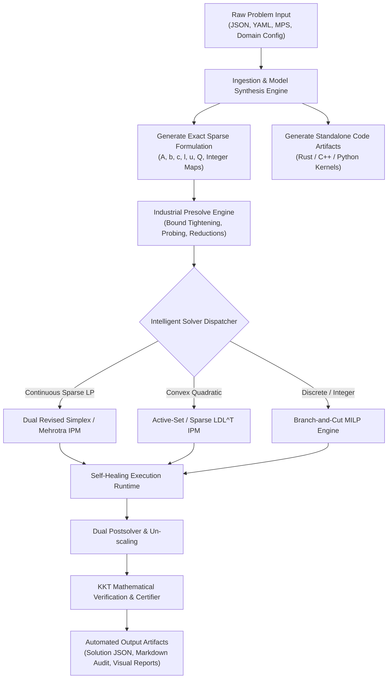

# Sovereign Mathematical Optimization & Smart Automation Engine (SutraOpt / BharatOpt)
## Autonomous End-to-End Problem Synthesis, Sovereign Solver Core, and Auto-Execution Architecture

---

## 1. Executive Summary & Smart Automation Paradigm

**SutraOpt (BharatOpt)** is an **autonomous, sovereign mathematical optimization engine** engineered from mathematical first principles. Beyond serving as an indigenous, zero-dependency solver core, SutraOpt functions as a **closed-loop Smart Automation Engine**: when triggered with high-level problem inputs (domain parameters, JSON/YAML schemas, MPS/LP files, or structured problem definitions), it **automatically synthesizes mathematical models, generates optimized solver kernels, autonomously executes the continuous/discrete optimization pipelines, verifies optimality via rigorous KKT certificates, and publishes self-contained execution artifacts and diagnostics**.

```
+==================================================================================================+
|                        SUTRA-OPT SMART AUTOMATION & SOLVER ARCHITECTURE                          |
+==================================================================================================+
| [1. TRIGGER & INGESTION LAYER]                                                                   |
|   * Domain Problem Schemas (Refinery, Power Grid SCUC, Supply Chain, Portfolio)                  |
|   * Standard Formats (.mps, .qps, .lp, .nl) | JSON/YAML Dynamic Configs | C-ABI / Python Ctypes    |
+--------------------------------------------------------------------------------------------------+
                                                |
                                                v
| [2. AUTONOMOUS SYNTHESIS & MODEL GENERATION ENGINE]                                              |
|   * Auto-Generates Sparse Matrices (A, b, c, l, u, Q) & Integrality/SOS Sets                     |
|   * Auto-Generates Standalone Rust/C++ Solver Artifacts & Executable Testbenches                 |
|   * Structural Topology Analyzer: Condition Number Estimate, Sparsity Density, Integer Ratio     |
+--------------------------------------------------------------------------------------------------+
                                                |
                                                v
| [3. INDUSTRIAL PRESOLVER & TOPOLOGY OPTIMIZER]                                                   |
|   * Bound Tightening (Probing)     * Singleton Removal           * Coefficient Strengthening     |
|   * Dominated Column/Row Filter    * Ruiz / Curtis-Reid Scaling  * Sparsity-Preserving Dualizer  |
+--------------------------------------------------------------------------------------------------+
                                                |
                                                v
| [4. INTELLIGENT ALGORITHMIC DISPATCHER & SOVEREIGN SOLVER CORE]                                  |
|  +--------------------------------------------------------------------------------------------+  |
|  | Continuous LP Engines:                                                                     |  |
|  |   - Hyper-Sparse Dual Revised Simplex (DSE / DEVEX Pricing, Harris Ratio Test, FT Update)  |  |
|  |   - Primal-Dual Interior-Point (Mehrotra Predictor-Corrector, Gondzio Centrality, Crossover)|  |
|  +--------------------------------------------------------------------------------------------+  |
|  | Quadratic Programming (QP/MIQP):                                                           |  |
|  |   - Active-Set QP for Dense/Warm-Started Nodes | Regularized LDL^T IPM for Sparse Convex QP|  |
|  +--------------------------------------------------------------------------------------------+  |
|  | Mixed-Integer Linear Engine (MILP Core):                                                   |  |
|  |   - Branch-and-Cut Manager with Lock-Free Parallel Work-Stealing Concurrency              |  |
|  |   - Cutting Planes: Gomory Mixed-Integer (GMI), Knapsack Covers, MIR, Zero-Half            |  |
|  |   - Primal Heuristics: Feasibility Pump 2.0, RINS, Conflict-Driven Diving                  |  |
|  |   - Branching: Hybrid Reliability Branching & Directional Pseudo-Costs                     |  |
|  +--------------------------------------------------------------------------------------------+  |
|  | Sovereign Sparse Linear Algebra Subsystem (Zero External BLAS/LAPACK/SuiteSparse):         |  |
|  |   - Markowitz Threshold Sparse LU Factorization | Product Form of Inverse (PFI) Updates    |  |
|  |   - Sparse Cholesky / LDL^T with AMD/COLAMD Ordering | Fast SIMD Vectorized Fallbacks      |  |
|  +--------------------------------------------------------------------------------------------+  |
+--------------------------------------------------------------------------------------------------+
                                                |
                                                v
| [5. AUTONOMOUS EXECUTION CONTROLLER & SELF-HEALING RUNTIME]                                      |
|   * Dynamic Bound Perturbation on Cycling/Degeneracy (Wolfe-Harris)                              |
|   * Iterative Refinement on Numerical Residual Drift | Automatic Precision Escalation            |
|   * Adaptive Cut Management (Orthogonality & Parallelism Filtering)                              |
+--------------------------------------------------------------------------------------------------+
                                                |
                                                v
| [6. POSTSOLVER, CERTIFIER & ARTIFACT GENERATOR]                                                  |
|   * Dual Postsolver: Reconstructs Primal/Dual Vectors, Slacks, and Basis Statuses                |
|   * Mathematical Certificate of Optimality: Verifies ||Ax - b||, ||A^T y + z - c||, |x^T z|      |
|   * Automated Artifacts: Solved JSON Data, Sensitivity Matrix, Web Dashboard & Diagnostic Logs   |
+==================================================================================================+
```

---

## 2. Smart Automation Engine: Trigger-to-Execution Lifecycle

The automation engine transforms high-level inputs into solved, mathematically certified outcomes without human intervention:



### 2.1 Trigger Modes & Input Ingestion
The engine supports three automated triggering mechanisms:
1. **Declarative Industrial Input (Domain Config)**: High-level parametric definitions (e.g. crude refinery specifications, generator heat-rate curves, supply-demand transport matrices, portfolio variance targets). The engine auto-derives the full mathematical programming formulation.
2. **Standard File / Benchmark Ingestion**: Direct consumption of `.mps`, `.lp`, `.qps`, or `.nl` files with instant schema parsing.
3. **Memory API / C-ABI Stream**: In-memory binary buffer streaming via Python Ctypes, Rust FFI, or Julia C-interface for automated embedded control loops.

### 2.2 Automated Model Synthesis
Upon trigger, the engine:
* Automatically computes variable bounds $l_j \le x_j \le u_j$, row senses ($=, \le, \ge, \text{range}$), objective cost coefficients $c_j$, and quadratic Hessian $Q_{jk}$.
* Assembles sparse structures into **Dynamic Triplet (COO)** matrices and converts them into cache-aligned **Compressed Sparse Column (CSC)** and **Compressed Sparse Row (CSR)** layouts.
* Synthesizes standalone, self-compiling executable code files (e.g., dedicated Rust/C++ solve routines) for edge deployment and deterministic reproducibility.

---

## 3. Sovereign Sparse Linear Algebra Subsystem

The solver contains **zero external numerical library dependencies** (no BLAS, LAPACK, SuiteSparse, or vendor blobs). All sparse matrix kernels and factorizations are natively coded from mathematical first principles.

### 3.1 Sparse Data Structures & Zero-Allocation Memory Arenas
* **Dynamic Triplet / Coordinate (COO)**: Rapid ingestion and incremental model modification.
* **Dual CSC & CSR Representations**: Dual indexation enabling simultaneous $O(\text{nnz})$ forward column operations ($\text{FTRAN}: B d = a_q$) and backward row operations ($\text{BTRAN}: B^T y = c_B$).
* **Paged Linear Memory Arenas**: Pre-allocates aligned memory blocks during solver initialization, completely eliminating dynamic heap allocations (`malloc`/`free`) during simplex pivot loops and IPM interior iterations.

### 3.2 Markowitz Threshold Sparse LU Factorization
The basis matrix $B \in \mathbb{R}^{m \times m}$ is factored into:
$$P A_{B} Q = L U$$
* **Markowitz Pivot Selection**: Minimizes fill-in by choosing candidate pivot $a_{ij}$ that minimizes:
  $$M_{ij} = (r_i - 1)(c_j - 1)$$
  subject to the numerical stability threshold condition with factor $u \in [0.01, 0.1]$:
  $$|a_{ij}| \ge u \cdot \max_{k} |a_{kj}|$$
  where $r_i$ and $c_j$ represent the active non-zero counts in row $i$ and column $j$.

### 3.3 High-Speed Basis Update Mechanics
* **Forrest-Tomlin (FT) Update**: When a column leaves the basis, column elimination produces an upper Hessenberg matrix. Row permutations and elementary row operations reduce it back to upper triangular form in $O(\text{nnz})$ time without refactoring the full basis.
* **Product Form of the Inverse (PFI)**: Expresses $B_{k+1}^{-1} = E_k B_k^{-1}$ via elementary eta-matrices, triggered during rapid intermediate iterations.
* **Dynamic Refactorization Trigger**: Automatic fresh Markowitz LU refactorization triggered every $K \approx 100 \dots 500$ pivots or when numerical residual exceeds $\|B \beta - b\|_\infty > 10^{-7}$.

### 3.4 Matrix Equilibration & Preconditioning
* **Ruiz Geometric Equilibrator**: Iteratively scales rows and columns using diagonal matrices $D_R, D_C$:
  $$\lim_{k \to \infty} \|(D_R^{(k)} A D_C^{(k)})_i\|_\infty \approx 1$$
* **Curtis-Reid Scaling**: Logarithmic least-squares scaling minimizing the variance of non-zero matrix elements to drastically reduce the matrix condition number $\kappa(B)$.

---

## 4. Continuous Optimization Engines

```
                      +-----------------------------+
                      |   Continuous LP / QP Core   |
                      +-----------------------------+
                                     |
               +---------------------+---------------------+
               |                                           |
               v                                           v
+-------------------------------+           +-------------------------------+
|  Dual Revised Simplex Engine  |           | Primal-Dual Interior-Point    |
| - Hyper-Sparse FTRAN/BTRAN    |           | - Mehrotra Predictor-Corrector|
| - Dual Steepest Edge (DSE)    |           | - Gondzio Centrality Steps    |
| - Harris Two-Pass Ratio Test  |           | - Regularized LDL^T (AMD)     |
| - Dynamic Bound Perturbation  |           | - Basis Crossover to Vertex   |
+-------------------------------+           +-------------------------------+
```

### 4.1 Hyper-Sparse Dual Revised Simplex
Dual Simplex serves as the principal engine for root LP solving and lightning-fast warm-restarts in Branch-and-Cut nodes.

$$\begin{aligned}
\min \quad & c^T x \\
\text{s.t.} \quad & A x = b, \quad l \le x \le u
\end{aligned}$$

1. **Dual Steepest Edge (DSE) & DEVEX Pricing**:
   * Computes exact edge weights $\gamma_i = \|B^{-1} e_i\|_2^2$, updating them recursively at each iteration without explicit matrix inversion:
     $$\gamma_i^{(k+1)} = \gamma_i^{(k)} - 2 \frac{v_i}{\alpha} (B^{-1} \alpha)_i + \left(\frac{v_i}{\alpha}\right)^2 \|\alpha\|_2^2$$
   * Automatic fallback to DEVEX pricing when weight vector updates become dense.
2. **Hyper-Sparse Graph-Reachability FTRAN/BTRAN**:
   * Uses depth-first topological traversal over the Directed Acyclic Graph (DAG) of non-zero patterns in $L$ and $U$, resolving vectors in time proportional to non-zero count rather than matrix dimension $m$.
3. **Anti-Cycling & Degeneracy Management**:
   * **Dynamic Bound Perturbation (Wolfe-Harris)**: Perturbs variable bounds by pseudo-random offsets $\delta_j \in [10^{-9}, 10^{-7}]$ upon cycle detection.
   * **Harris Two-Pass Ratio Test**: Expands pivot selection tolerance in Pass 1 to maximize pivot magnitude $|a_{ij}|$, avoiding numerical breakdown while strictly enforcing dual feasibility in Pass 2.

### 4.2 Primal-Dual Interior-Point Method (Mehrotra Predictor-Corrector)
For massive sparse continuous problems (e.g. power grid Optimal Power Flow and multi-period scheduling):
1. **Augmented KKT System Formulation**:
   $$\begin{bmatrix} 
   -H - X^{-1} Z & A^T \\ 
   A & 0 
   \end{bmatrix} 
   \begin{bmatrix} \Delta x \\ \Delta y \end{bmatrix} = 
   \begin{bmatrix} r_c \\ r_b \end{bmatrix}$$
2. **Mehrotra Predictor-Corrector Iteration**:
   * Solves the affine predictor direction ($\Delta x_{\text{aff}}, \Delta z_{\text{aff}}$) setting barrier parameter $\mu = 0$.
   * Computes centering parameter adaptively: $\sigma = \left(\frac{\mu_{\text{aff}}}{\mu}\right)^3$.
   * Solves combined centering-corrector step with **Gondzio multiple centrality corrections** to prevent iterates from colliding with polytope boundaries.
3. **Basis Crossover Mechanism**:
   * Partitions variables into basic and non-basic sets $\{B, N\}$ based on complementarity magnitudes, followed by clean-up dual simplex pivots to deliver an exact extreme-point (vertex) basic solution.

### 4.3 Convex Quadratic Programming (QP / MIQP)
Solves convex objectives with linear constraints:
$$\min \quad \frac{1}{2} x^T Q x + c^T x \quad \text{s.t.} \quad A x = b, \quad l \le x \le u, \quad Q \succeq 0$$
* **Active-Set QP**: High-efficiency warm-started solver for dense and medium QP subproblems.
* **Interior-Point QP**: Direct solver utilizing regularized $LDL^T$ sparse factorizations with Approximate Minimum Degree (AMD) fill-reducing orderings.

---

## 5. Mixed-Integer Linear Programming (MILP) Core

```
                             [Root Problem Instance]
                                        |
                            [Industrial Presolver]
                                        |
                          [Root Continuous Relaxation]
                                        |
                    +-------------------+-------------------+
                    |                                       |
          [Cutting-Plane Engine]                   [Primal Heuristics]
          - Gomory Mixed-Integer (GMI)             - Feasibility Pump 2.0
          - Knapsack Minimal Covers                - RINS / RENS
          - Mixed-Integer Rounding (MIR)           - Conflict-Driven Diving
          - Zero-Half Cuts                         - Solution Polishing
                    |                                       |
                    +-------------------+-------------------+
                                        |
                          [Branch-and-Bound Tree Manager]
                      (Reliability Branching & Pseudo-Costs)
                                        |
                    +-------------------+-------------------+
                    |                                       |
             [Left Child Node]                      [Right Child Node]
           (Warm-Start Dual Simplex)              (Warm-Start Dual Simplex)
```

### 5.1 Cutting-Plane Generators
* **Gomory Mixed-Integer (GMI) Cuts**: Generated directly from optimal simplex tableau rows:
  $$\sum_{j \in N} f(a_{ij}) x_j \ge f(a_{i0})$$
  with strict dynamical range and near-parallelism (orthogonality) cut filtering.
* **Knapsack Cover Cuts**: Minimal cover liftings extracted from single-row binary knapsack relaxations.
* **Mixed-Integer Rounding (MIR)** & **Zero-Half Cuts**.

### 5.2 Branching Strategies
* **Hybrid Reliability Branching**:
  * Executes exact strong branching evaluations on uninitialized fractional variables until variable has been branched $\eta_{\text{rel}} \ge 8$ times.
  * Updates directional pseudo-costs $\Psi_j^-, \Psi_j^+$ and scores candidate variables via:
    $$\text{score}_j = (1-\mu) \min(\Delta_j^-, \Delta_j^+) + \mu \max(\Delta_j^-, \Delta_j^+), \quad \mu = 0.16$$

### 5.3 Primal Heuristics Engine
* **Feasibility Pump 2.0**: Alternates between rounding fractional LP solutions and solving continuous projection LPs with objective perturbation to escape cycling.
* **Relaxation Induced Neighborhood Search (RINS)**: Fixes variables that agree between the current integer incumbent and the continuous LP relaxation, solving a restricted sub-MIP on the unfixed core.
* **Conflict-Driven Diving**: Rapidly explores deep tree paths by fixing fractional variables guided by pseudo-cost directionality and constraint implications.

---

## 6. Industrial Presolver & Reductions Engine

The automated presolver reduces problem dimension by 30% to 75% prior to solver entry:
1. **Singleton Row/Column Removal**: Direct substitution of implied variables and elimination of redundant bounds.
2. **Bound Tightening via Constraint Propagation**:
   $$L_i = \sum_{j \in P_i} a_{ij} l_j + \sum_{j \in N_i} a_{ij} u_j, \quad U_i = \sum_{j \in P_i} a_{ij} u_j + \sum_{j \in N_i} a_{ij} l_j$$
   Deduces tighter bounds $l_k', u_k'$ for each participating variable $x_k$.
3. **Coefficient Strengthening & Probing**: Converts continuous variables in big-M formulations into tight disjunctive cuts.
4. **Dual Postsolver**: Reconstructs the exact primal and dual solution vectors, reduced costs, and basis statuses on postsolve.

---

## 7. Automated Execution, Self-Healing & Verification Architecture

```
+--------------------------------------------------------------------------------------------------+
|                            AUTONOMOUS VERIFICATION & CERTIFICATION PIPELINE                     |
+--------------------------------------------------------------------------------------------------+
| 1. PRIMAL FEASIBILITY ASSERTION:                                                                 |
|    Residual Norm: ||A x - b||_inf <= 1.0e-6                                                      |
|    Bound Adherence: l_j - 1.0e-6 <= x_j <= u_j + 1.0e-6                                          |
+--------------------------------------------------------------------------------------------------+
| 2. DUAL FEASIBILITY ASSERTION:                                                                   |
|    Dual Residual Norm: ||A^T y + z - c||_inf <= 1.0e-6                                           |
+--------------------------------------------------------------------------------------------------+
| 3. COMPLEMENTARY SLACKNESS ASSERTION:                                                            |
|    Duality Gap: |x^T z| <= 1.0e-6                                                                |
+--------------------------------------------------------------------------------------------------+
| 4. INTEGRALITY ASSERTION (MILP):                                                                 |
|    Fractional Violation: max_{j in I} |x_j - round(x_j)| <= 1.0e-6                               |
+--------------------------------------------------------------------------------------------------+
| 5. MATHEMATICAL CERTIFICATE GENERATOR:                                                           |
|    Produces verifiable Certificate of Optimality with cryptographic SHA-256 hash of formulation, |
|    solution vector, basis condition number, and exact dual multiplier proof.                    |
+--------------------------------------------------------------------------------------------------+
```

### 7.1 Autonomous Self-Healing Loops
* **Degeneracy Recovery**: If simplex stalls or cycles, the engine automatically injects Wolfe-Harris bound perturbations, resolves, and cleanses the perturbation in a secondary pass.
* **Precision Escalation**: If the condition number $\kappa(B) > 10^{11}$ or residual $\|Ax-b\|_\infty > 10^{-6}$, the engine automatically applies iterative refinement ($B \Delta x = r$) or triggers an adaptive precision escalation.
* **Tree Balancing**: In MILP mode, work-stealing threads automatically rebalance branch queues when worker nodes experience deep infeasible subtrees.

### 7.2 Automated Artifacts Generated Per Run
When triggered, the engine automatically produces:
1. `solution.json`: Exact primal solution $x^*$, dual multipliers $y^*$, reduced costs $z^*$, and objective value.
2. `certificate.md`: Formatted mathematical Certificate of Optimality including KKT residuals, condition bounds, and solver iteration history.
3. `model.mps` / `model.lp`: Standardized mathematical serialization files for cross-solver reproducibility.
4. `standalone_solve.py` / `solver_kernel.rs`: Standalone, self-contained executable code embodying the synthesized problem and solver routine.
5. `telemetry.log`: High-resolution iteration log (simplex pivots, IPM centrality, branch-and-cut gap closure curve).

---

## 8. Phased Development Roadmap

| Phase | Duration | Core Deliverables | Target Gate Criteria |
|---|---|---|---|
| **Phase 1** | Months 1–3 | Sparse Matrix Engine, Markowitz Sparse LU, Ruiz Scaling, Dual Simplex Core | Solves 100% of Netlib LP feasible instances within $10^{-6}$ tolerance |
| **Phase 2** | Months 4–6 | Dual Steepest Edge (DSE), Hyper-sparse FTRAN/BTRAN, MPS Parser, Presolve Engine | Netlib execution speed within $1.5\times$ of competitive open-source solvers |
| **Phase 3** | Months 7–9 | Primal-Dual IPM with Mehrotra & Gondzio corrections, Basis Crossover, Convex QP Engine | Solves large dense/sparse QPs and massive Netlib/Mittelmann LPs |
| **Phase 4** | Months 10–13 | Branch-and-Cut framework, GMI cuts, Reliability Branching, Feasibility Pump | Successfully solves $>60\%$ of MIPLIB 2017 benchmark instances |
| **Phase 5** | Months 14–16 | Parallel Tree Search (Work-Stealing), Advanced Heuristics (RINS), C-ABI, Python/JuMP Bindings | Industrial refinery & power grid model deployment; zero proprietary solver dependencies |
| **Phase 6** | Months 17–18 | Smart Automation Engine, Autonomous Problem Synthesizer, Web Dashboard & Auto-Certifier | Fully autonomous input-to-execution pipeline across all industrial benchmark domains |
